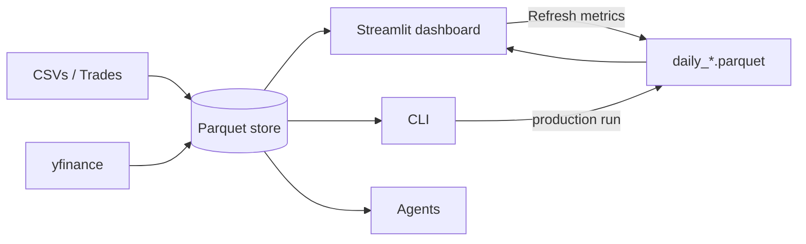

# Invest Monitor

A personal investment-portfolio monitoring tool with risk analytics, ETF lookthrough, daily performance attribution, a Streamlit dashboard, and three Claude-powered agents.

!!! info "Personal use"
    This tool is built for personal portfolio analysis. It is not investment advice, and the historical-data approximations baked into the regime presets, benchmarks, and stress scenarios are starting points — verify against your own reference data before using them for any consequential decision.

## What it does

- **Portfolio tracking** across multiple accounts, stored as local Parquet files.
- **Price collection** via yfinance, with per-ticker daily history.
- **ETF / Fund lookthrough** — vendor holdings CSVs *and* a yfinance fund-profile fallback, so opaque "ETF" buckets get decomposed into actual underlying tickers (or at least sector-level breakdowns).
- **Risk analytics** — volatility, historical and Monte Carlo VaR, drawdown, covariance / correlation matrices, sector-level stress tests with optional implied-shock matrix derived from 20-year SPDR sector ETF betas.
- **Daily performance attribution** — security-, portfolio-, and contribution-level metrics persisted to parquet. v2 trade-replay reconstructs historical positions from your BUY/SELL ledger.
- **Wealth projection** — deterministic or Monte Carlo with cross-asset correlations, historical regime presets (1970s Stagflation, 1980s Bull Run, 1990s Japan, …), and a Safe Withdrawal Rate layer that compares survival across rates against the same return paths.
- **Benchmark portfolios** — 60/40, All Seasons, Golden Butterfly, Permanent, Risk Parity, 3-Fund Bogle, Coffeehouse, Larry — overlay on cumulative-return charts to see how your actual mix stacks up.
- **Scheduled production runs** — `production` jobs (collect prices, refresh metrics, refresh sector betas, refresh fund profiles) with systemd integration on Linux.
- **Demo mode** — a separate `data_demo/` store so you can show off the app without exposing live accounts.
- **AI agents** — Risk, Wealth, Research — usable from the CLI or the dashboard's embedded chat.

## Three ways to drive it

## Where to start

1. **[Getting Started](getting-started.md)** — installation, `.env`, your first portfolio.
2. **[Dashboard](dashboard.md)** — Multi-Portfolio Dashboard and Single Portfolio views.
3. **[Benchmarks](benchmarks.md)** and **[Performance Attribution](performance-attribution.md)** — the killer combo for "did I beat 60/40 this quarter?".
4. **[Wealth Projection](wealth-projection.md)** — including Monte Carlo with regime presets and the Safe Withdrawal Rate layer.
5. **[AI Agents](ai-agents.md)** — Risk / Wealth / Research, accessible from the CLI or the dashboard.

## Stack

Python 3.14+, [Streamlit](https://streamlit.io), [Click](https://click.palletsprojects.com), [Plotly](https://plotly.com/python/), [DuckDB](https://duckdb.org), [yfinance](https://github.com/ranaroussi/yfinance), the [Anthropic SDK](https://github.com/anthropics/anthropic-sdk-python). Data stored as [Parquet](https://parquet.apache.org/) files via pandas + pyarrow. Docs built with [Material for MkDocs](https://squidfunk.github.io/mkdocs-material/).
