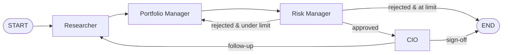

# Multi-Agent Coordination Graph

A LangGraph-based coordination layer in which four agents — **Researcher**,
**Portfolio Manager**, **Risk Manager**, and **CIO** — share a single
`TradingState` and pass control via routed edges. Agents never call each other
directly; the graph routes.

This system is **distinct from the conversational agents** documented under
[AI Agents](ai-agents.md). The Risk / Wealth / Research / PM / CIO chat
agents are single-actor tool-runners you talk to directly. The coordination
graph is a multi-actor pipeline that produces a vetted trade proposal.

The PM and CIO chat agents in [AI Agents](ai-agents.md) are the human-facing
counterparts to the `portfolio_manager` and `cio` nodes here — same mental
model, separate code paths. Future work will share implementations between
the two (spec step 8).

!!! info "Current status (May 2026)"
    Steps 1–7 of the build sequence are complete: scaffold, state, config,
    deterministic stub nodes, routing, graph wiring, and a verified
    human-in-the-loop pause. Real LLM prompts (step 8) and a fully
    scenario-driven CLI (step 9) are not yet wired in — nodes return
    deterministic placeholders so the graph is end-to-end testable today.

## Architecture



The PM ↔ Risk loop is bounded by `Settings.max_revisions` so a chronically
disagreeing pair cannot spin forever. With `human_in_the_loop=True` the
graph **interrupts before the CIO node** so a human can inspect the
approved allocation before sign-off; resume by re-invoking the compiled app
with `None` on the same `thread_id`.

## State contract

`src/trading_graph/state.py` defines `TradingState`. Reducers:

| Key | Type | Reducer |
|---|---|---|
| `messages` | `list[BaseMessage]` | append (`add_messages`) |
| `risk_critique` | `list[str]` | append (`operator.add`) |
| `market_signal` | `dict \| None` | last-write-wins |
| `whitelist` | `list[str]` | last-write-wins |
| `proposed_trades` | `dict \| None` | last-write-wins |
| `risk_approved` | `bool` | last-write-wins |
| `final_execution_ready` | `bool` | last-write-wins |
| `revision_count` | `int` | last-write-wins (incremented by PM) |

`initial_state()` returns a valid empty state. **`risk_critique` accumulates
across rejections — it is never overwritten**, so the PM can see the full
history of objections when revising.

## Nodes

Each node is a pure function `TradingState → dict[str, Any]` that returns
only the keys it modified.

| Node | Reads | Writes |
|---|---|---|
| `researcher_node` | inputs, optional CIO follow-up | `market_signal`, `whitelist`, `messages` |
| `portfolio_manager_node` | `market_signal`, latest `risk_critique` | `proposed_trades`, `revision_count` (++), `messages` |
| `risk_manager_node` | `proposed_trades`, thresholds from `Settings` | `risk_approved`; on fail also `risk_critique` (one appended string), `messages` |
| `cio_node` | approved allocation + state | one of: `final_execution_ready=True`; OR follow-up routing to Researcher; OR override to `proposed_trades`; plus `messages` |

## Configuration

`src/trading_graph/config.py` — `Settings` (frozen dataclass).

| Setting | Default | Purpose |
|---|---|---|
| `model_name` | `"claude-sonnet-4-20250514"` | LLM used by nodes (once real prompts wired) |
| `human_in_the_loop` | `True` | If true, graph interrupts before CIO acts |
| `max_revisions` | `3` | Caps the PM ↔ Risk loop |
| `var_limit` | `0.05` | Risk Manager VaR threshold |
| `max_sector_concentration` | `0.30` | Risk Manager concentration check |

No risk threshold or model name is hardcoded inside a node — all flow from
`Settings`.

## Running it

Programmatic:

```python
from src.trading_graph import Settings, build_graph, initial_state

app = build_graph(Settings(human_in_the_loop=False))
config = {"configurable": {"thread_id": "run-1"}}
final = app.invoke(initial_state(), config=config)
print(final["final_execution_ready"])  # True
```

With HITL:

```python
app = build_graph(Settings(human_in_the_loop=True))
config = {"configurable": {"thread_id": "run-2"}}

# First invocation pauses before the CIO node.
paused = app.invoke(initial_state(), config=config)
# ...inspect paused["proposed_trades"], get human sign-off...
resumed = app.invoke(None, config=config)
```

CLI smoke test (deterministic stubs):

```bash
uv run python -m src.trading_graph.run
```

## Tests

| File | Covers |
|---|---|
| `tests/test_trading_graph_state.py` | Reducer semantics: append vs last-write-wins |
| `tests/test_trading_graph_routing.py` | All branches of `route_after_risk` and `route_after_cio`, including loop-guard bail-out |
| `tests/test_trading_graph_smoke.py` | End-to-end termination, HITL pause+resume, forced-rejection loop bounded by `max_revisions` |

Run with `uv run pytest tests/test_trading_graph_*.py`.

## Build sequence

Tracked against `SPEC_multi_agent_trading_system.md`:

- [x] 1. Scaffold layout
- [x] 2. State + reducer tests
- [x] 3. Config
- [x] 4. Stub nodes
- [x] 5. Routing + tests
- [x] 6. Graph assembly + smoke test
- [x] 7. HITL pause verified
- [ ] 8. Replace stubs with real LLM prompts (Anthropic via `model_name`)
- [ ] 9. CLI scenario runner
